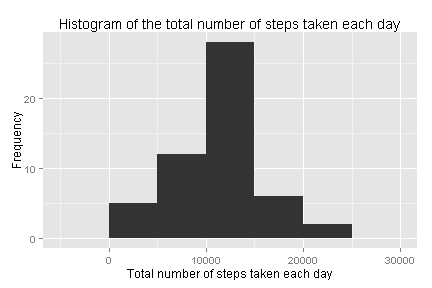
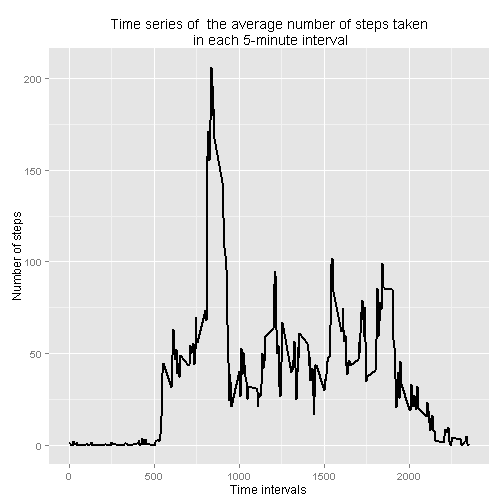
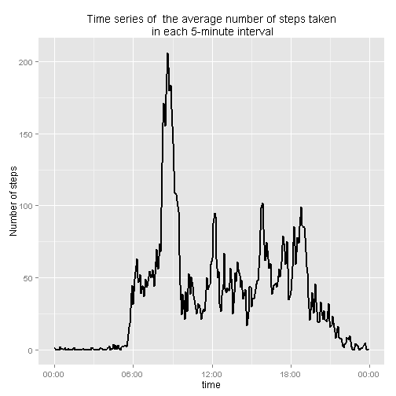
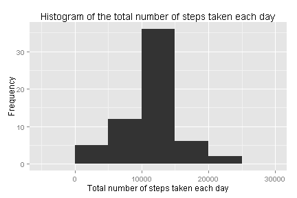
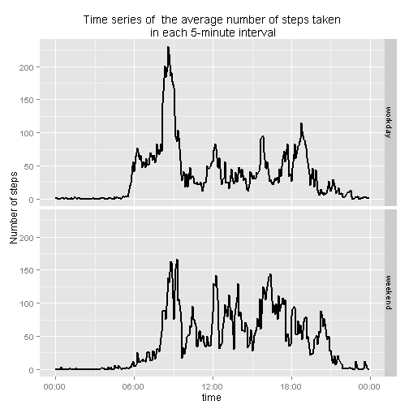

Firstly, we set global options and preload **dplyr** and **ggplot2** packages.


```r
knitr::opts_chunk$set( echo = TRUE )
library(dplyr); library("ggplot2"); library(scales)
```

## Loading and preprocessing the data

We unzip activity.zip file and read unzipped activity.csv into R.  
And transform the variable, date of df dataframe into Date type.


```r
zipfile <- "activity.zip"
unzip(zipfile)

csvfile <- "activity.csv"
df <- read.csv(csvfile, stringsAsFactors = FALSE)
df <- transform(df, date = as.Date(date))
```


## What is mean total number of steps taken per day?

We ignore the missing value in df dataset and calculate the total number of steps taken per day.  Make a histogram of the total number of steps taken each day.


```r
stepsPerDay <- df %>% group_by(date) %>% summarise( steps_per_day = sum(steps))
title = "Histogram of the total number of steps taken each day"
xlab = "Total number of steps taken each day";ylab ="Frequency"
g <- ggplot(stepsPerDay, aes( steps_per_day ))
g + geom_histogram( binwidth = 5000 ) + labs(title=title, x=xlab, y=ylab)+theme_grey()
```



```r
mean_steps <- mean(stepsPerDay$steps_per_day, na.rm = TRUE) 
median_steps <- median(stepsPerDay$steps_per_day, na.rm = TRUE)
```

From the results, we find that the mean of the total number of steps taken per day is **10766.189** and the median of the total number of steps taken per day is **10765**.


## What is the average daily activity pattern?


```r
meanSteps <- function(df){
        stepsIn5min <-  df%>% group_by( interval) %>% summarise( steps_per_interval= mean( steps, na.rm = TRUE ))
        #add a new column, time
        stepsIn5min$time <- formatC(stepsIn5min$interval, width = 4, format = "d", flag = "0")
        #insert ":"" between hours and minutes
        stepsIn5min$time <- sub("([[:digit:]]{2,2})$", ":\\1", stepsIn5min$time)
        #transform time into POSIXct type.
        stepsIn5min$time <- as.POSIXct( stepsIn5min$time, format="%H:%M")
        stepsIn5min
}

stepsIn5min <-  meanSteps( df )
title ="Time series of  the average number of steps taken\n in each 5-minute interval"
xlab = "Time intervals"; ylab = "Number of steps"
g <- ggplot(stepsIn5min, aes( interval, steps_per_interval ))
g + geom_line( size = 0.8 ) + labs(title=title, x=xlab, y=ylab)+theme_grey()
```



```r
#real time series plot
g <- ggplot(stepsIn5min, aes( time, steps_per_interval ))
mytimezone <- Sys.timezone()
g + geom_line( size = 0.8 ) + labs(title=title, x="time", y=ylab)+
        scale_x_datetime( labels= date_format("%H:%M", tz = mytimezone ))
```



```r
maxsteps <- max(stepsIn5min$steps_per_interval)
intervalMaxSteps <- stepsIn5min$interval[which.max(stepsIn5min$steps_per_interval)]
```
When I look the values of interval varible carefully, such as 0 5 10...55 100 ..., I realize that this sequence means 00:00 00:05 00:10...00:55 01:00 .... So we can transform this sequece into date-time type variable, time, and draw a real time series just showed above. Since the interval variable is not a equal-difference squence, time variable may be a better choice.

Identifier **835** of 5-minute interval(i.e. time **8:35-8:40**), on average across all the days in the dataset, contains the maximum number of steps.  And the corresponding maximum number of steps is **206.170**.


## Imputing missing values

```r
#the total number of missing values in the dataset
n_na <- sum(is.na(df$steps))

#Replace the missing values in the dataset, df,  with  
#the mean for corresponding 5-minute interval. Create a new dataset, newdf.

newdf <- df
stepsvec <- df$steps
datevec <- df$date
intervalvec <- df$interval
interval <- stepsIn5min$interval
for (i in interval) {
        newdf$steps[intervalvec == i & is.na(stepsvec)] <- 
                stepsIn5min$steps_per_interval[stepsIn5min$interval==i]
}

#Make a histogram of the total number of steps taken each day  
stepsPerDay2 <- newdf %>% group_by(date) %>% summarise( steps_per_day=sum(steps))

title = "Histogram of the total number of steps taken each day" 
xlab = "Total number of steps taken each day"; ylab = "Frequency"
g <- ggplot(stepsPerDay2, aes( steps_per_day ))
g + geom_histogram( binwidth = 5000 ) + labs(title=title, x=xlab, y=ylab)+theme_grey()
```



```r
#Calculate the mean and median total number of steps taken per day.
mean_steps2 <- mean(stepsPerDay2$steps_per_day)
median_steps2 <- median(stepsPerDay2$steps_per_day)


#The difference of mean steps and median steps in these two cases.
diff_mean_steps <- mean_steps2-mean_steps
diff_median_steps <- median_steps2-median_steps
```

The total number of missing values in the dataset is **2304**.  
We replace the missing values with the mean for that 5-minute interval.  
A new dataset, newdf, which is equal to the original dataset but with the missing data filled in.  
We make a histogram of the total number of steps taken each day.  
The mean and median total number of steps taken per day in the case of ignoring the missing value and in the case of imputing the missing value are showed in the table behind. 

Item | ignore the missing value | impute the missing value | the difference
:----:|:-----------------------:|:-------------------------:|:-------------:
The mean total number of steps taken per day |10766.189 |10766.189 |0.000
The median total number of steps taken per day |10765 |10766.189 |1.1886792

The differences of these two variables are very small. This may be related to our strategy for replacing the missing values with the mean for that 5- minute interval. 


## Are there differences in activity patterns between weekdays and weekends?


```r
newdf2 <- newdf %>% mutate(weekend = as.POSIXlt(date)$wday %in% c(0,6))
workdaydf <- filter(newdf2, weekend==FALSE)
weekenddf<- filter(newdf2, weekend== TRUE)

workday <- transform(meanSteps(workdaydf), type = "workday" )
weekend <- transform(meanSteps(weekenddf), type = "weekend" )
uniondf <- rbind(workday, weekend)

title ="Time series of  the average number of steps taken\n in each 5-minute interval"
xlab = "Time intervals"; ylab = "Number of steps"
g <- ggplot(uniondf, aes(interval, steps_per_interval))
g + geom_line( size= 0.8 ) +facet_grid( type ~ .) +
        labs(title=title, x=xlab, y=ylab)
```


```r
#real time series plot
g <- ggplot(uniondf, aes( time, steps_per_interval))
g + geom_line( size= 0.8 ) +facet_grid( type ~ .) +
        labs(title=title, x="time", y=ylab)+
        scale_x_datetime( labels= date_format("%H:%M", tz = mytimezone ))
```


We use **ggplot2** to draw a panel plot containing a time series plot of the 5-minute interval (x-axis) and the average number of steps taken, averaged across all weekday days or weekend days (y-axis). The figure above shows that there is something different in activity patterns between weekdays and weekends. In weekdays people may take more steps in **Interval 500-800**,i.e.**5:00-8:00**, while in weekend people may take more steps in **Interval 1000-2000**, i.e.**10:00-20:00**.
